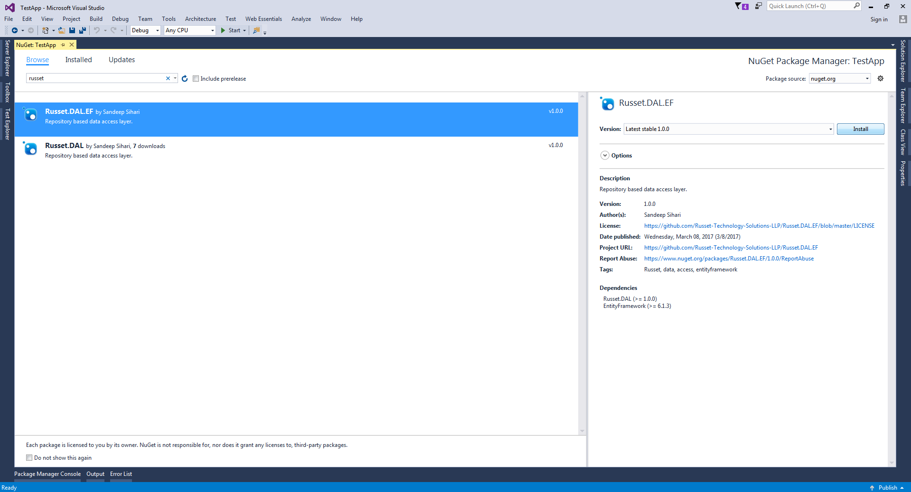
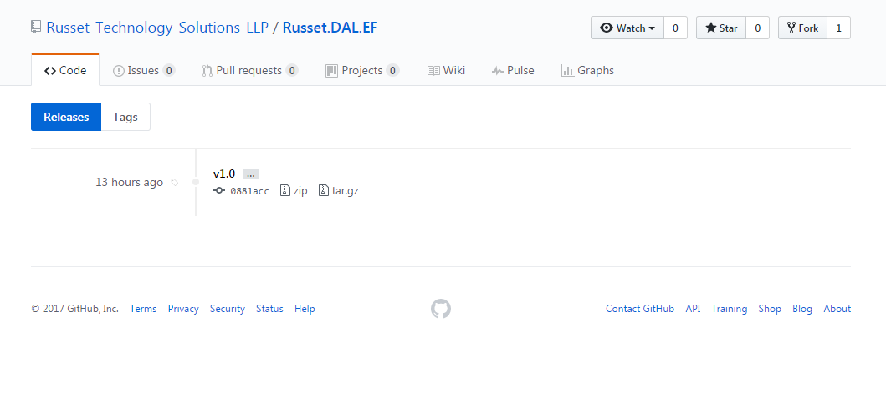

# Welcome to Russet.DAL.EF
This library is a extension of [Russet.Dal](https://github.com/Russet-Technology-Solutions-LLP/Russet.DAL) library using [Entity Framework](https://github.com/aspnet/EntityFramework6) ORM.
## How to get it ?   
### 1. From [Nuget](https://www.nuget.org/packages/Russet.DAL.EF/)   
* You can install it from **Nuget** by typing on package manager:   

    `PM> Install-Package Russet.DAL.EF`  
* You can install it from **Visual Studio** to your project.   
   
### 2. From [Github](https://github.com/Russet-Technology-Solutions-LLP/Russet.DAL.EF/releases)
* If you want latest release or build from source. download latest [release](https://github.com/Russet-Technology-Solutions-LLP/Russet.DAL.EF/releases/tag/v1.0) here.   

